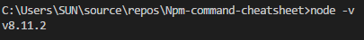
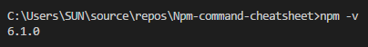
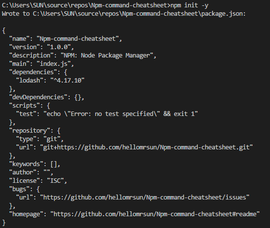
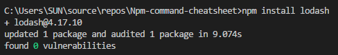
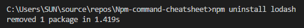
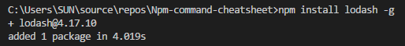
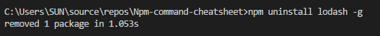

# NPM cheat sheet #

NPM: **Node Package Manager**

You need to install Node.js before use npm.

#### Check node version

````bash
> node -v
````



#### Check npm version

````bash
> npm -v
````



#### Initialize default package.json file

````bash
> npm init -y
````



#### Install package locally on project

````bash
> Format: npm install package-name
> Ex: npm install lodash
````



lodash package is installed on:

> C:\Users\SUN\source\repos\Npm-command-cheatsheet\node_modules

#### Uninstall local package

````bash
> Format: npm uninstall package-name
> Ex: npm uninstall lodash
````



#### Install global package

````bash
> Format: npm install package-name -g / --global
> Ex: npm install lodash -g
````



lodash package is installed on:

> C:\Users\SUN\AppData\Roaming\npm\node_modules\lodash

#### Uninstall global package

````bash
> Format: npm uninstall package-name -g / --global
> Ex: npm uninstall lodash -g
````



lodash package is removed from:

> C:\Users\SUN\AppData\Roaming\npm\node_modules\

#### Install latest version of package

````bash
> Format: npm install package-name@latest
> Ex: npm install ng-zorro-antd@latest
````

#### Install a specific version of package and save

````bash
> Format: npm install package-name@version-number
> Ex: npm install ng-zorro-antd@9.1.1
````

#### Install version range of package and save in package.json

Save is default behavior when package.json file exists.

Installed last version under 9.2.0.*, which is 9.2.0 itself:
````bash
> Ex: npm install ng-zorro-antd@^9.2.0 --save
````

Installed last version under 9.2.*, which is 9.2.2
````bash
> Ex: npm install ng-zorro-antd@^9.2 --save
````

Install last version under 9.*, which is 9.3.0
````bash
> Ex: npm install ng-zorro-antd@^9 --save
````

Install last version between 9.1.0 and 9.1.5(does not exist), which is 9.1.2

````bash
> Ex: npm install ng-zorro-antd@">= 9.1.0 < 9.1.5" --save
````


#### NPM Proxy

Set prxoy:

````bash
> npm config set proxy http://{domain}%5C{account}:{password}@{proxy}:{port}
````

Check proxy:

````bash
> npm get proxy
````

You can also check file : C:\Users\\{user_profile}\\.npmrc
