# Npm cheat sheet

NPM: **Node Package Manager**

You need to install Node.js before use npm.

## Check node version

````bash
> node -v
````

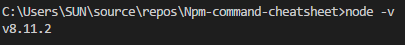

## Check npm version

````bash
> npm -v
````

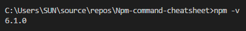

## Initialize default package.json file

````bash
> npm init -y
````

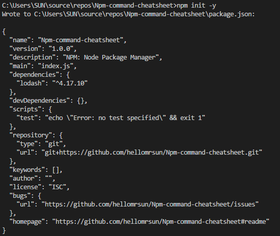

## Install package locally on project

````bash
> Format: npm install package-name
> Ex: npm install lodash
````

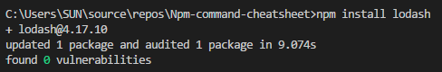

lodash package is installed on:

> C:\Users\SUN\source\repos\Npm-command-cheatsheet\node_modules

## Uninstall local package

````bash
> Format: npm uninstall package-name
> Ex: npm uninstall lodash
````

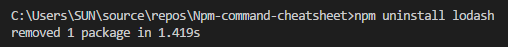

## Install global package

````bash
> Format: npm install package-name -g / --global
> Ex: npm install lodash -g
````

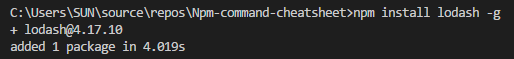

lodash package is installed on:

> C:\Users\SUN\AppData\Roaming\npm\node_modules\lodash

## Uninstall global package

````bash
> Format: npm uninstall package-name -g / --global
> Ex: npm uninstall lodash -g
````

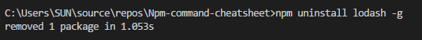

lodash package is removed from:

> C:\Users\SUN\AppData\Roaming\npm\node_modules\

## Install specific version of package

````bash
> Format: npm install package-name@version-number
> Ex: npm install lodash@4.17.4
````

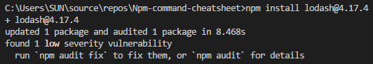

## Install latest version of package

````bash
> Format: npm install package-name@latest
> Ex: npm install lodash@latest
````

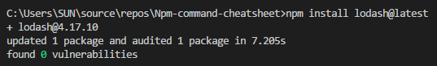

## Install 3.5.*X* version range of package

````bash
> Format: npm install package-name@^version-number
> Ex: npm install lodash@^3.5.0
````

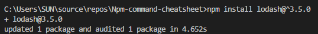

## Install version range of package and save in package.json

Save is default behavior when package.json file exists.

````bash
> Format: npm install package-name@version-number --save
> Ex: npm install lodash@4.17.4 --save
````

Package.json:

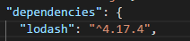

## Install version  of package and save the exact version in package.json

````bash
> Format: npm install package-name@version-number --save-exact
> Ex: npm install lodash@4.17.4 --save-exact
````

Package.json:

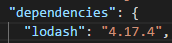


Set prxoy:

````bash
> npm config set proxy http://{domain}%5C{account}:{password}@{proxy}:{port}
````

Check proxy:

````bash
> npm get proxy
````

You can also check file : C:\Users\\{user_profile}\\.npmrc
